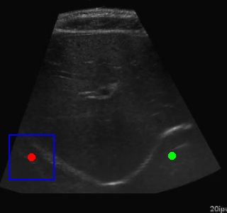

# Segmentación de Imágenes por Ultrasonido y Navegación con RL

Este repositorio implementa un sistema que combina la segmentación de imágenes basada en aprendizaje profundo con aprendizaje por refuerzo para la navegación automatizada hacia regiones de interés en imágenes por ultrasonido. El proyecto demuestra aplicaciones potenciales en imagen médica y guía de ultrasonido robótica.

## 🎯 Descripción General del Proyecto

El sistema consta de tres componentes principales:

1. **Segmentación de Imágenes**: Un modelo U-Net basado en ResNet entrenado para segmentar regiones de interés en imágenes de ultrasonido abdominal
2. **Detección de Centros**: Un algoritmo para encontrar los centros de las regiones segmentadas  
3. **Navegación con Aprendizaje por Refuerzo**: Un agente DQN entrenado para navegar hacia los centros de las regiones segmentadas

## ✨ Características Principales

- Arquitectura U-Net basada en ResNet18 para una segmentación robusta
- Agente DQN con repetición de experiencias para un aprendizaje de navegación eficiente
- Mecanismos de detección y prevención de oscilaciones
- Herramientas integrales de evaluación y visualización
- Soporte para entrenamiento en nuevos conjuntos de datos

## 🚀 Inicio Rápido

### Instalación

```bash
git clone https://github.com/AnandMayank/ultrasound-rl-navigation.git
cd ultrasound-rl-navigation
pip install -r requirements_clean.txt
```

### Uso Básico

1. **Entrenar Modelo de Segmentación**:
```bash
python train_segmentation.py
```

2. **Entrenar Agente de Navegación**:
```bash
python train_navigation.py
```

3. **Ejecutar Tubería Completa (Pipeline)**:
```bash
python main.py --mode pipeline
```

4. **Demo en una Imagen Individual**:
```bash
python main.py --mode demo --image path/to/your/image.png
```

## 📁 Estructura del Repositorio

```
├── core/                      # Core model implementations
│   ├── segmentation_model.py  # ResNet U-Net segmentation model
│   ├── navigation_agent.py    # DQN agent for navigation
│   ├── navigation_environment.py # RL environment
│   └── utils.py               # Utility functions
├── results/                   # Training and evaluation results
│   ├── segmentation_examples/ # Example segmentation outputs
│   ├── navigation_training/   # Training metrics and GIFs
│   ├── navigation_demos/      # Demo navigation sequences
│   └── trained_models/        # Pre-trained model weights
├── train_segmentation.py      # Segmentation training script
├── train_navigation.py        # Navigation training script
├── main.py                    # Main pipeline script
└── requirements_clean.txt     # Dependencies
```

## 🔬 Arquitectura del Modelo

### Modelo de Segmentación ResNet U-Net

El modelo de segmentación utiliza una arquitectura U-Net con un tronco base ResNet18 para una extracción de características robusta y una segmentación precisa de las regiones abdominales en imágenes por ultrasonido.

### Agente de Navegación DQN

El agente de navegación utiliza Aprendizaje Q Profundo con repetición de experiencias para aprender estrategias de navegación eficientes. Las mejoras clave incluyen:

- Mecanismos de detección y penalización de oscilaciones
- Movimiento basado en momento para una navegación más fluida
- Función de recompensa basada en la distancia cuadrática
- Seguimiento del progreso para un mejor aprendizaje

## 📊 Resultados

El agente entrenado navega exitosamente hacia los centros de las regiones segmentadas con altas tasas de éxito. El sistema demuestra:

- Segmentación efectiva de imágenes de ultrasonido abdominal
- Navegación eficiente con oscilaciones mínimas
- Buena generalización bajo diferentes condiciones de imagen

### Resultados Visuales

Consulte la carpeta `results/` para ver:
- **Ejemplos de Segmentación**: Máscaras de segmentación de alta calidad y superposiciones
- **Entrenamiento de Navegación**: GIFs que muestran el progreso del aprendizaje desde el episodio 100 hasta el 500
- **Demos de Navegación**: Secuencias completas de navegación paso a paso

## 🎬 Demo



*El agente aprende a navegar de manera eficiente hacia el centro de las regiones abdominales segmentadas*

## 📝 Publicación en Blog

Para una explicación detallada de la metodología y los resultados, consulte la publicación en blog adjunta:
[Segmentación de Imágenes por Ultrasonido y Navegación con RL](https://anandmayank.github.io/Ultrasound_Image_rl/abdomen_segmentation_rl_blog_post.html)

## ⚠️ Limitaciones

- Brecha en la calidad de imagen entre las condiciones de entrenamiento y el mundo real
- Dependencia de una iluminación constante y un contacto adecuado del transductor
- Robustez limitada frente a variaciones anatómicas del paciente

## 🔮 Trabajos Futuros

- Entrenamiento en conjuntos de datos más grandes y diversos
- Implementación de espacios de acción continuos
- Integración con sistemas robóticos
- Procesamiento de datos de ultrasonido en tiempo real
- Reconocimiento de características mejorado para reducir la dependencia de la distancia

## 📄 Citación

Si utiliza este código en su investigación, por favor cítelo así:

```bibtex
@misc{ultrasound_rl_navigation,
  title={Ultrasound Image Segmentation and Reinforcement Learning Navigation},
  author={Anand Mayank},
  year={2024},
  url={https://github.com/AnandMayank/ultrasound-rl-navigation}
}
```

## 📞 Contacto

- **GitHub**: [AnandMayank](https://github.com/AnandMayank)
- **LinkedIn**: [Anand Mayank](https://www.linkedin.com/in/mayank-anand-480741231)
- **Blog del Proyecto**: [Navegación con RL para Ultrasonido](https://anandmayank.github.io/Ultrasound_Image_rl/)

## 📜 Licencia

Licencia MIT - consulte el archivo LICENSE para más detalles.

---

*Este proyecto demuestra la integración de visión por computadora y aprendizaje por refuerzo para aplicaciones de imagen médica.*
