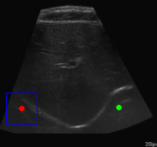

# Ultrasound Image Segmentation and RL Navigation

This repository implements a system that combines deep learning-based image segmentation with reinforcement learning for automated navigation to regions of interest in ultrasound images. The project demonstrates potential applications in medical imaging and robotic ultrasound guidance.

## 🎯 Project Overview

The system consists of three main components:

1. **Image Segmentation**: A ResNet-based U-Net model trained to segment regions of interest in abdominal ultrasound images
2. **Center Detection**: An algorithm to find the centers of the segmented regions  
3. **Reinforcement Learning Navigation**: A DQN agent trained to navigate to the centers of the segmented regions

## ✨ Key Features

- ResNet18-based U-Net architecture for robust segmentation
- DQN agent with experience replay for efficient navigation learning
- Oscillation detection and prevention mechanisms
- Comprehensive evaluation and visualization tools
- Support for training on new datasets

## 🚀 Quick Start

### Installation

```bash
git clone https://github.com/AnandMayank/ultrasound-rl-navigation.git
cd ultrasound-rl-navigation
pip install -r requirements_clean.txt
```

### Basic Usage

1. **Train Segmentation Model**:
```bash
python train_segmentation.py
```

2. **Train Navigation Agent**:
```bash
python train_navigation.py
```

3. **Run Complete Pipeline**:
```bash
python main.py --mode pipeline
```

4. **Demo on Single Image**:
```bash
python main.py --mode demo --image path/to/your/image.png
```

## 📁 Repository Structure

```
├── core/                      # Core model implementations
│   ├── segmentation_model.py  # ResNet U-Net segmentation model
│   ├── navigation_agent.py    # DQN agent for navigation
│   ├── navigation_environment.py # RL environment
│   └── utils.py               # Utility functions
├── results/                   # Training and evaluation results
│   ├── segmentation_examples/ # Example segmentation outputs
│   ├── navigation_training/   # Training metrics and GIFs
│   ├── navigation_demos/      # Demo navigation sequences
│   └── trained_models/        # Pre-trained model weights
├── train_segmentation.py      # Segmentation training script
├── train_navigation.py        # Navigation training script
├── main.py                    # Main pipeline script
└── requirements_clean.txt     # Dependencies
```

## 🔬 Model Architecture

### ResNet U-Net Segmentation Model

The segmentation model uses a U-Net architecture with a ResNet18 backbone for robust feature extraction and accurate segmentation of abdominal regions in ultrasound images.

### DQN Navigation Agent

The navigation agent uses Deep Q-Learning with experience replay to learn efficient navigation strategies. Key improvements include:

- Oscillation detection and penalty mechanisms
- Momentum-based movement for smoother navigation
- Quadratic distance-based reward function
- Progress tracking for better learning

## 📊 Results

The trained agent successfully navigates to the centers of segmented regions with high success rates. The system demonstrates:

- Effective segmentation of abdominal ultrasound images
- Efficient navigation with minimal oscillations
- Good generalization across different image conditions

### Visual Results

Check the `results/` folder for:
- **Segmentation Examples**: High-quality segmentation masks and overlays
- **Navigation Training**: GIFs showing learning progression from episode 100 to 500
- **Navigation Demos**: Complete step-by-step navigation sequences

## 🎬 Demo



*The agent learns to navigate efficiently to the center of segmented abdominal regions*

## 📝 Blog Post

For detailed explanation of the methodology and results, see the accompanying blog post:
[Ultrasound Image Segmentation and RL Navigation](https://anandmayank.github.io/Ultrasound_Image_rl/abdomen_segmentation_rl_blog_post.html)

## ⚠️ Limitations

- Image quality gap between training and real-world conditions
- Dependency on consistent lighting and probe contact
- Limited robustness to patient anatomical variations

## 🔮 Future Work

- Training on larger and more diverse datasets
- Implementation of continuous action spaces
- Integration with robotic systems
- Real-time ultrasound data processing
- Improved feature recognition for reduced distance dependency

## 📄 Citation

If you use this code in your research, please cite:

```bibtex
@misc{ultrasound_rl_navigation,
  title={Ultrasound Image Segmentation and Reinforcement Learning Navigation},
  author={Anand Mayank},
  year={2024},
  url={https://github.com/AnandMayank/ultrasound-rl-navigation}
}
```

## 📞 Contact

- **GitHub**: [AnandMayank](https://github.com/AnandMayank)
- **LinkedIn**: [Anand Mayank](https://www.linkedin.com/in/mayank-anand-480741231)
- **Project Blog**: [Ultrasound RL Navigation](https://anandmayank.github.io/Ultrasound_Image_rl/)

## 📜 License

MIT License - see LICENSE file for details.

---

*This project demonstrates the integration of computer vision and reinforcement learning for medical imaging applications.*
